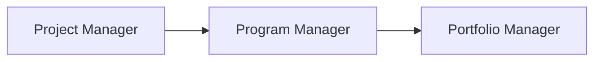

# **Exploring Project Management Roles**

Project management is a dynamic and high-demand career that offers opportunities across multiple industries. This lecture explores various project management roles, their career progression, and how transferable skills can help professionals transition into the field.

---

## **Project Management Job Categories and Common Roles**

### **Introductory-Level Project Management Roles**

These roles provide entry points into the project management field, allowing professionals to gain foundational experience:

- **Junior Project Manager** – Assists a more experienced project manager in handling all aspects of a project.
- **Project Administrator** – Provides administrative support to project teams.
- **Project/Program Assistant** – Assists team members, conducts research, and creates training documents.
- **Project/Program Coordinator** – Ensures projects stay on time and within budget, working under a project manager.
- **Project Support Specialist** – Works alongside the project manager and team, providing oversight and employee training.

### **Traditional Project Management Roles**

Once professionals gain experience, they can move into these more defined project management positions:

- **Project Manager** – Manages project initiation, planning, execution, monitoring, and closure.
- **Project Analyst** – Supports projects through data analysis and strategy recommendations.
- **Project Leader/Director** – Guides project direction and decision-making.
- **Project Controller** – Primarily responsible for planning, common in engineering and construction industries.
- **Technical Project Manager** – Manages technical project planning, ensuring completion within scope, budget, and time.
- **PMO Analyst** – Oversees complex project execution and tracks progress.

---

## **Program and Portfolio Management Roles**

Professionals can advance beyond individual projects into broader managerial responsibilities:

- **Program Manager** – Oversees multiple related projects and ensures effective communication among project teams.
- **Portfolio Manager** – Manages a collection of programs within an organization, ensuring alignment with strategic goals.

### **Career Progression Path:**

At each stage:

- **Project Managers** handle individual projects.
- **Program Managers** oversee multiple related projects and ensure coordination.
- **Portfolio Managers** manage a collection of projects and programs, ensuring they align with an organization's strategic goals.

This hierarchical structure provides clear career progression opportunities for project management professionals.

---

## **Operational Management Roles**

These roles offer experience in managing business operations across different departments:

- **Operations Analyst** – Investigates workflows, conducts research, and suggests business process improvements.
- **Operations Manager** – Oversees strategic planning based on financial and resource reports.
- **Chief Operating Officer (COO)** – Manages the daily administrative and operational functions of a business.

---

## **Agile Project Management Roles**

With the growing adoption of Agile methodologies, specific roles have emerged:

- **Scrum Master** – Facilitates Agile teams by ensuring adherence to Scrum principles.
- **Product Owner** – Directs product development and manages priorities.

---

## **Industry-Specific Management Roles**

Project management skills are transferable across industries. Some industry-specific roles include:

- **IT Project Manager** – Oversees software and IT-related projects.
- **Construction Project Manager** – Manages building and infrastructure projects.
- **Engineering Project Manager** – Leads engineering initiatives.

Regardless of industry, professionals can apply their project management expertise across different domains.

---

## **Key Takeaways**

- Project management offers a wide range of career opportunities.
- Entry-level positions provide foundational experience leading to more advanced roles.
- Professionals can progress from **Project Manager → Program Manager → Portfolio Manager**.
- Transferable skills allow individuals to transition between industries.
- Agile methodologies introduce specialized roles like **Scrum Master** and **Product Owner**.
- Operational management roles offer broader business exposure beyond traditional project management.

This career path enables continuous growth and development, making it a valuable choice for professionals across industries. 🚀
